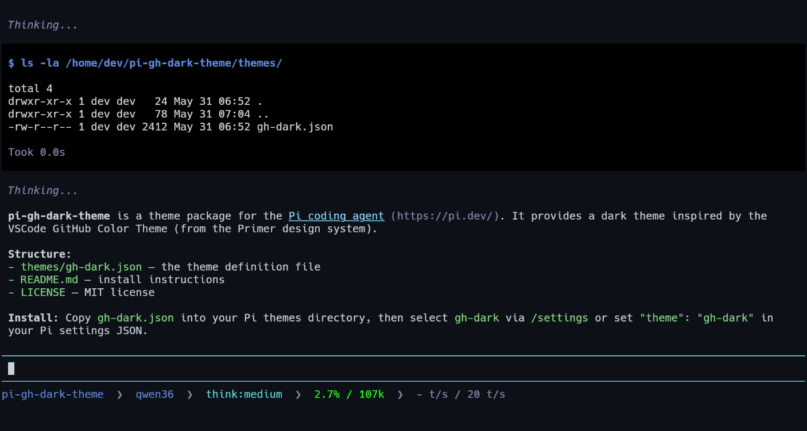

# pi-gh-dark-theme

Theme package for the [Pi coding agent](https://pi.dev/) inspired by the dark themes of the [VSCode Github Color Theme](https://github.com/primer/github-vscode-theme/)



# Install

Copy `gh-dark.json` to your (themes directory)[https://github.com/earendil-works/pi/blob/main/packages/coding-agent/docs/themes.md#locations]

Then select `gh-dark` in `/settings`, or add it to your Pi settings:

```json
{
  "theme": "gh-dark"
}
```
